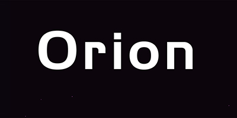
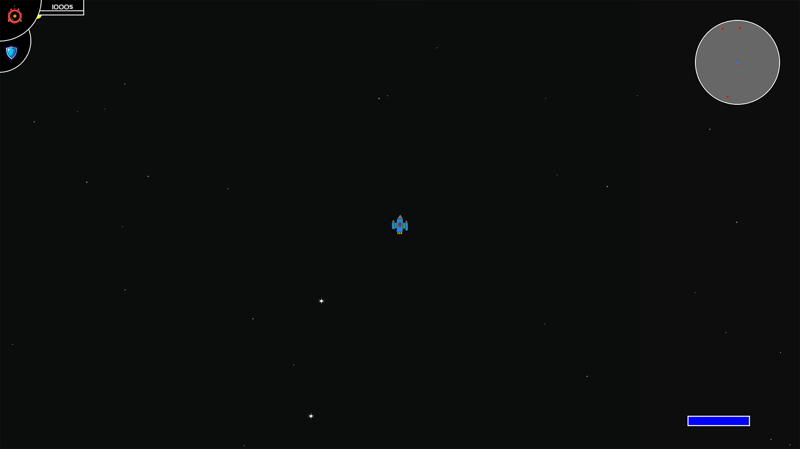

# Orion

  

<i>Welcome to Orion, an intergalactic journey where you take control of your own starship in the vastness of space! Embark on an epic adventure through a procedurally generated universe, where danger and discovery await at every corner.</i>

## General Overview

Orion is my first substantial hobbyist game project, crafted in C++ as a vessel for learning and experimentation. This 2D space shooter is a result of my journey into the realms of programming.
- Programming Language: C++
- Graphics and Rendering: SFML (Simple and Fast Multimedia Library)
- Build System: CMake
- Entity-Component System: EnTT

## Current Project Status

Orion is currently in the prototype phase, far from a full-fledged alpha version. The project primarily serves as a tool for honing programming skills in C++. I am currently focused on implementing fundamental game mechanics, testing different approaches, and learning from the process. It is still an experimental stage, where the main goal is to acquire knowledge and experience in the game development journey. Further project development will be shaped by gaining new skills and incorporating more advanced gameplay elements.

## Right Now

  

