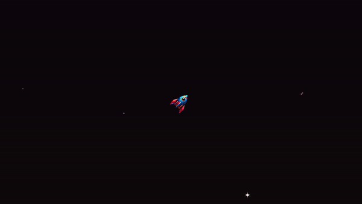
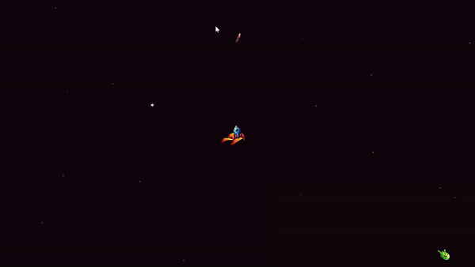
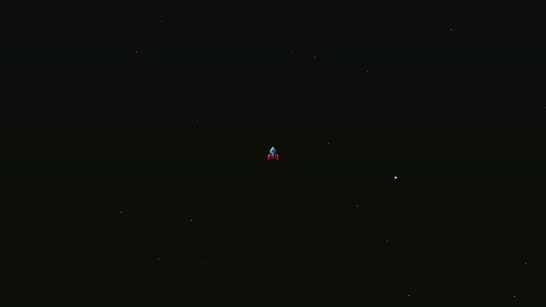
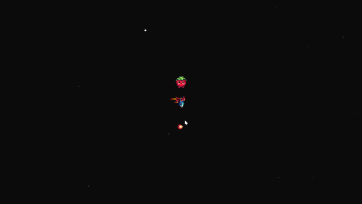
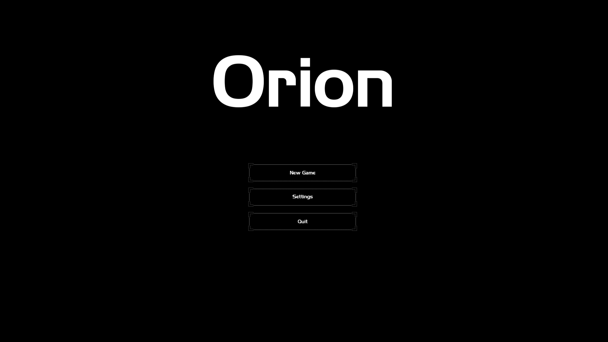
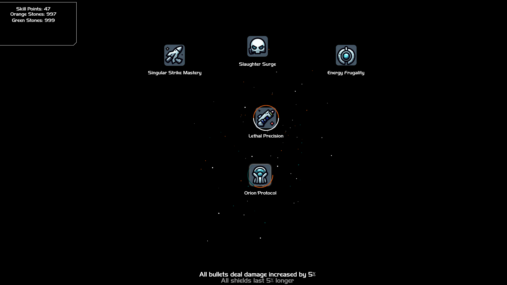
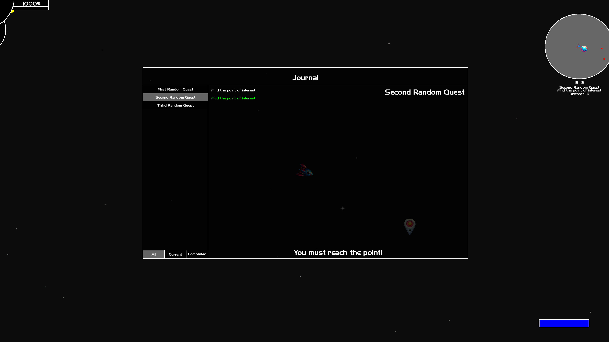
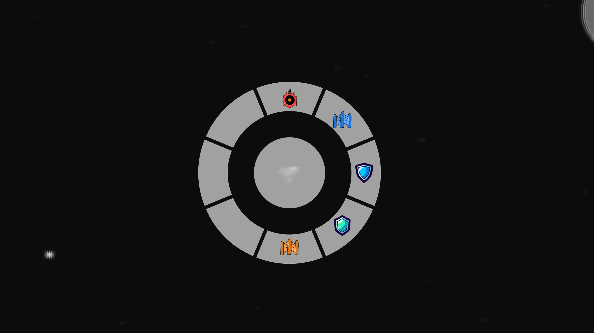
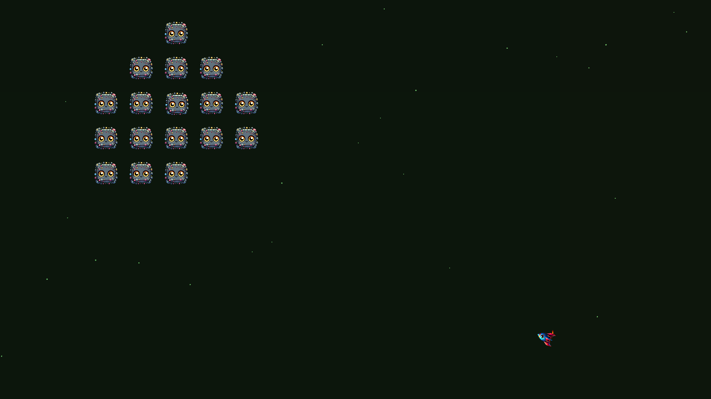

# Orion

<p align="center">
  
</p>

<p align="center">
<i>Welcome to Orion, an intergalactic journey where you take control of your own starship in the vastness of space! Embark on an epic adventure through a procedurally generated universe, where danger and discovery await at every corner.</i>
</p>

## General Overview

Orion is my first substantial hobbyist game project, crafted in C++ as a vessel for learning and experimentation. This 2D space shooter is a result of my journey into the realms of programming.
- Programming Language: C++
- Graphics and Rendering: [SFML (Simple and Fast Multimedia Library)](https://www.sfml-dev.org/)
- Build System: [CMake](https://cmake.org/)
- Entity-Component System: [EnTT](https://github.com/skypjack/entt)
- Linker: [LLD](https://lld.llvm.org/)
- Additional Libraries:
  - [nlohmann/json](https://github.com/nlohmann/json)
  - [Boost](https://www.boost.org/)

## Current Project Status

Orion is currently in the prototype phase, far from a full-fledged alpha version. The project primarily serves as a tool for honing programming skills in C++. I am currently focused on implementing fundamental game mechanics, testing different approaches, and learning from the process. It is still an experimental stage, where the main goal is to acquire knowledge and experience in the game development journey. Further project development will be shaped by gaining new skills and incorporating more advanced gameplay elements.

## Building Orion - Quick Guide

<p align="center" style="font-size: 14px;">
  <i>Note: Orion is currently developed and tested on the <b>Windows</b> platform. Compatibility with other operating systems is not guaranteed at this experimental stage.</i>
</p>

To compile the Orion project on your machine, follow these straightforward steps:

### 1. Prerequisites

Ensure the following tools are installed on your machine:

- CMake version 3.10 or higher
- C++23 compatible compiler
- LLVM Linker (lld)
- SFML version 2.6
- Boost version 1.84.0 or later
- Git

### 2. Clone the Repository

Clone the Orion project repository using the following command:

```bash
git clone https://github.com/alekskoloch/Orion.git
```

### 3. Navigate to the Project

Move to the Orion project directory:
```bash
cd Orion
```
Create a "build" folder and navigate to it:
```bash
mkdir build
cd build
```

### 4. Configure with CMake

Run CMake in the "build" folder to configure the project:
```bash
cmake ..
```

### 5. Build and run the Project

Compile the project using the compilation tool available on your operating system.

```bash
cmake --build . --config Release --target main -j
```

After successful compilation, run the project executable:
```bash
./main
```
## Gameplay

<p align="center">
  
</p>
<p align="center">
  <i>basic spaceship movement mechanics</i>
</p>
<br>
<br>
<p align="center">
  
</p>
<p align="center">
  <i>fight against enemies</i>
</p>
<br>
<br>
<p align="center">
  
</p>
<p align="center">
  <i>various weapons and special shots</i>
</p>
<br>
<br>
<p align="center">
  
</p>
<p align="center">
  <i>various enemies</i>
</p>
<br>
<br>

## Features

### Main Menu
Start or continue your journey. Adjust settings to customize your gaming experience. Fine-tune the resolution, frame rate limits, and window mode to your preferences.

<p align="center">
  
</p>

### Skill Tree
Progress through a skill tree by gaining experience points from defeating enemies. Upon leveling up, receive skill points to allocate into various abilities. Some skills may require special stones obtained from defeated enemies.

<p align="center">
  
</p>

### Quest Journal
Keep track of your journey with a detailed quest journal. Monitor tasks, quest stages, and waypoints on the minimap to guide you through the procedurally generated universe.

<p align="center">
  
</p>

### Quick Selection Menu
Utilize the quick selection menu to choose items of interest. As the inventory system is implemented, players will be able to customize this menu based on their preferences.

<p align="center">
  
</p>

### Grouping Monster
Monsters of the same type team up in formations when close. Get ready for coordinated attacks that evolve over time, bringing a dynamic gameplay experience in future updates.

<p align="center">
  
</p>

## Upcoming Features and Fixes

### Enhancements for Next Update
In the upcoming update, attention is directed towards enhancing the overall gameplay experience. Here's what you can expect:

#### Tutorial
A comprehensive tutorial will be added to help new players understand the game mechanics better.

#### Buildings
Players will be able to spend their in-game currency at newly introduced buildings such as shops or workshops.

#### Inventory
An inventory system will be added, enabling players to efficiently manage their equipment.

## Todo List and Known Issues

#### Shields
Emphasis is placed on refining the implementation of shields to ensure a fair and balanced gameplay experience. Adjustments will be made to enhance overall game balance.

#### Sound Effects
There are issues with overlapping sound effects that are currently being addressed.

## Get Involved!
Your feedback and contributions play a vital role in shaping the future of Orion. Whether it's suggesting new features, reporting bugs, or providing general feedback, your participation is highly valued. Let's work together to make Orion the best it can be!